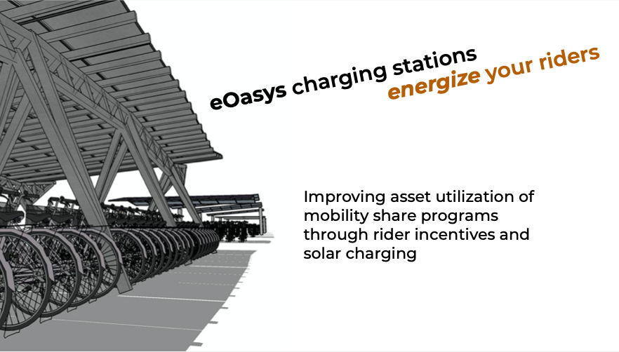
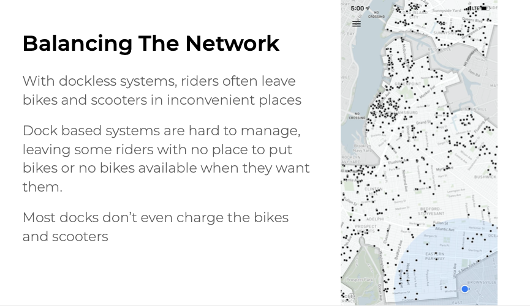
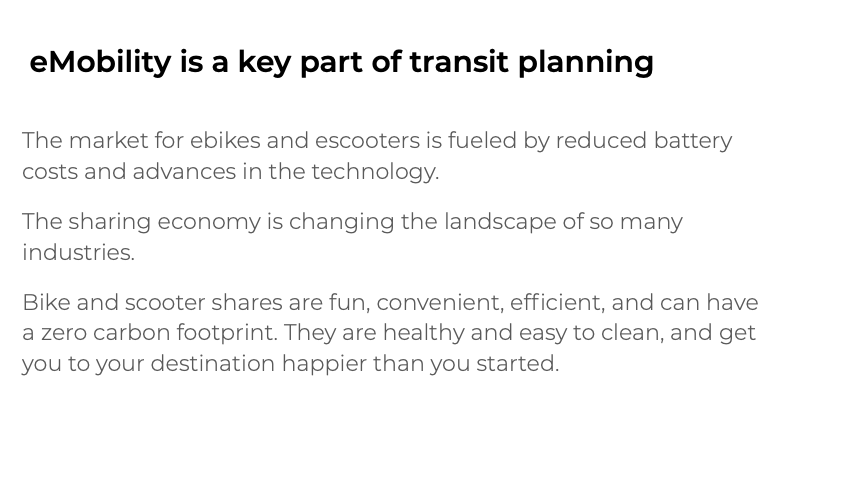
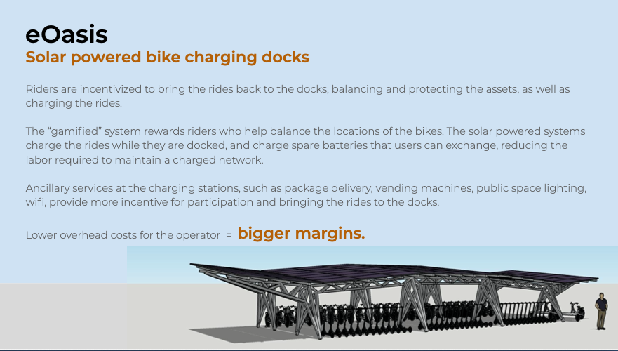

# project-manta
Project Manta is a set of Micro-Mobility best practices for bike share and scooter share operators. The goal is to establish and share ideas that can be incorporated into bike share programs around the world. For more info, contact me : solarjohn  (at) gmail.com

 

 

 

